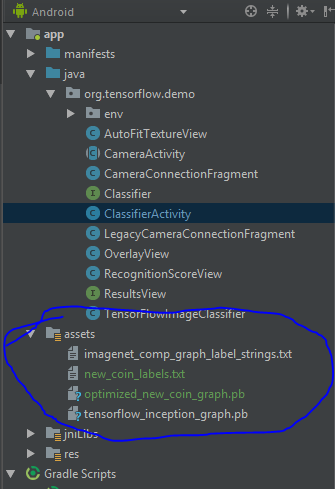
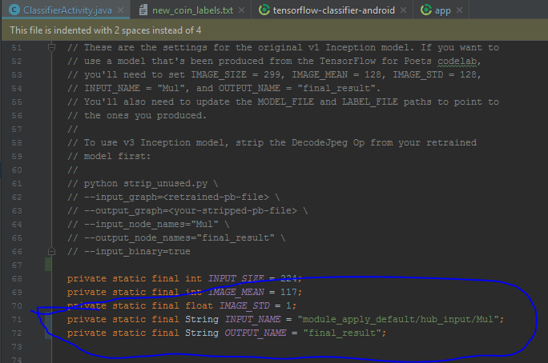

# Creating an Image Classifier on Android using Tensorflow 

Documentation by [Jared Frank](https://github.com/jfrank1120)

## Required Tools for this Project
1.	Git Bash - https://git-scm.com/download/win or any preferred bash shell (I highly reccommend this one)
2.	Python 3.6.5 - https://www.python.org/ftp/python/3.6.5/python-3.6.5-amd64.exe
> Note – The 64bit version of python is needed in for this project, **32bit will not work**
3.	Android Studio - https://developer.android.com/studio/


## How to Install Tensorflow to your machine
Tensorflow is a robust machine learning tool that allows for not only classical machine learning to be done, but also neural network creation and such.
1.	Download the [Tensorflow library](https://github.com/tensorflow/tensorflow) (Green button on the far right) 

> Note -- *Make sure to create a new directory to store this file along with other necessary files*
**In my case I will call this directory 'TF_Files'**
2.	Once these files have been downloaded you want to extract them into the TF_Files folder


## Downloading necessary files for Training
This section will contain all of the links and instructions for retrieving the files that are needed to successfully train a Tensorflow graph for image processing. All of the following files should be added to the TF_Files folder to allow for easier access when training.
1.	The pre-trained model that we will do learning transfer on [Link](http://download.tensorflow.org/models/inception_v4_2016_09_09.tar.gz)
Once this file has been downloaded you will use bash and go into its directory and use the following command:
```
 tar -xzf inception_v4_2016_09_09.tar.gz
```


If this is successful you will see a new file in the same directory named ‘inception_v4.ckpt’

2.	Retrain.py is in this document below. If you do not have the file the following web-address has the file’s text contents so you will have to paste the contents into a new text file. [Download Link](https://github.com/tensorflow/hub/blob/master/examples/image_retraining/retrain.py)

**If you copy the file from this document you do not need to do the following step**


If you downloaded the file from the link, you will have to add the following line into the code: 
```
import os
os.environ['TF_CPP_MIN_LOG_LEVEL'] = '2'
```


## Adding Image Data for Training
This section will explain how to format images so that you can properly train the network for the image or images that you want
1.	Create a folder within TF_Files named ‘ImageData’.
2.	Within that folder create as many sub-folders as objects you would like to detect with your network. EX- Nickel, Dime, Penny, etc
3.	Add all of your desired images to their corresponding folders 


## Training the Network with your Images
1.	Before you attempt to this step make sure that python is correctly working within your bash shell by attempting the following command:
```
where python
```
> If python is correctly in your path then it will display its location to you. If not feel free to refer to the trouble shooting section of this document or look on online resources


2.	After this you also want to make sure that Pip and Pip3 are also correctly working within you bash shell by attempting the following command:
```
where pip
```
> If either of these commands do not correctly display the location of these variables feel free to look at the trouble shooting portion of this document below or consult online resources.

3.	After this point you are going to want to use the following command:
```
pip3 install tensorflow
```


4.	At this point the shell may give you errors such as “missing requirement ‘numpy’ or missing requirement ‘tensorflow-hub’. In either of these cases retype the previous command but with either name substituted for ‘tensorflow’: 
 ```
 pip3 install numpy
 pip3 install tensorflow-hub
 ```
 
 
5.	At this point you are ready to begin training your network. You will now type the following command:
 > Make sure you are in the TF_files directory if not make sure to reference the filepath accordingly
 ```
 python retrain.py \
 --how_many_training_steps 4000 \
 --model_dir=inception_v4.ckpt \
 --output_graph=new_retrained_graph.pb \
 --output_labels=new_labels.txt \
 --image_dir=ImageData
 ```
 > *Note – If an error occurs involving not being able to write to the location remove the ‘--output_graph’ portion of the command
 
(This will cause the file to be saved as a generic name which will not make a difference for use)*


6.	After all of the processing has been done, you can go check C:\tmp to see if your files are there
Optimizing your graph for Android Use
In this section you will optimize your graph so that it can be used on an Android device for image processing on the device natively.
 - First you need to copy over your .pb file and output_labels.txt file to the TF_Files folder. 
> **Note – The files should be in TF_Files from the previous step**
 - Once these files are in the TF_Files folder you need to open up the IDLE python shell and type the following commands:
```
import tensorflow as tf
gf = tf.GraphDef()
gf.ParseFromString(open('your/path/to/graphname.pb', rb).read())
```
```
[n.name + '=>' + n.op for n in gf.node if n.op in ('Output_Node','Input_Node')]
```


If you have typed this in correctly the shell should look like this:
> **Note – For file location and name will be different **
```
>>> ['module_apply_default/hub_input/Mul=>Mul', 'final_result=>Softmax']
```
> *Take note of the portions before the arrows in both of the elements in the array which in my case are *‘module_apply_default/hub_input/Mul’* and *‘final_result’* these will be necessary for later steps. **The first is the “input node” and the latter is the “output node”**.


 - Then type the following command into your bash shell within the TF_Files directory:
```
python tensorflow-master/tensorflow/python/tools/optimized_for_interference.py \
--input=new_retrained_graph.pb \
--output=optimized_graph.pb \
--input_names='module_apply_default/hub_input/Mul' \
--output_names='final_result' \
```
> Note- Input_names and output_names may be different based on the data that was returned in the previous step. Make sure that your command data matches that data that was previously found above


## Android Integration
1.	In Bash Shell go to the directory where you would like to create your android project in
2.	Once in that location type the following command in your git bash shell:
```
git clone https://github.com/Nilhcem/tensorflow-classifier-android
```


3.	After the project has been successfully cloned, you can open it in android studio.
4.	Here you need to make three changes to then successfully compile and run the app
I.	Under the ‘Assets’ folder on the right hand side of the project you need to add both the .pb file as well as the labels .txt file:



II.	After this you need to go into the ‘ClassifierActivity.java’ file and change the variables ‘INPUT_NAME’ and ‘OUTPUT_NAME’ to the input and output variables that you retrieved from the python script you ran in a previous step:


 
III.	After this has been done, all you have to do is change the variables ‘MODEL_FILE’ and ‘LABEL_FILE’ to the corresponding name of the files that you just added to the asset folder:


 
5.  After all these steps have been completed you can compile and run your android app 


## Further Help
In the case of any issues with the program check [this file](./Trouble-Shooting.md)

## External Resources 
[General Guide on Training](http://nilhcem.com/android/custom-tensorflow-classifier)

[Finding Input and Output Nodes](https://stackoverflow.com/questions/43517959/given-a-tensor-flow-model-graph-how-to-find-the-input-node-and-output-node-name)

[Android Project Git Page](https://github.com/Nilhcem/tensorflow-classifier-android)
